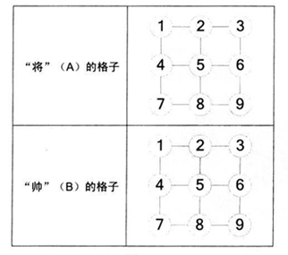

## 中国象棋将帅问题

### Description

---------------------------------

中国象棋中，将帅相隔遥远，并且不能照面，假设棋盘上只有将和帅两字，如下图所示（A表示将，B表示帅）：A、B二子被限制在己方3 x 3的格子里运动，每一步，A、b分别可以横向或纵向移动一格，但不能沿对角线移动。另外，A不能面对B，也就是说，A和B不能处于同一纵向直线上。

要求 : 写出一个程序，输出A、B的合法位置。




### Solution

-----------------------------

一般看到这道题的思路，都是采用两个变量来记录A、B的坐标，并计算 `A%3!= B%3` 来判断A、B是否在同一列上。题解如下 : 

```java
	private static final int LEN = 3;
	private static final int MAX_NUM = 9;
    private static void chineseChess1() {
        for (int i=1; i<=MAX_NUM; i++) {
            for (int j=1; j<MAX_NUM; j++) {
                if (i % LEN != j % LEN) {	// AB不在同一列位置上
                    System.out.println("A = " + i + " --- B =" + j);
                }
            }
        }
    }
```

因为题目要求只能够使用一个变量，这样子我们就必须考虑在一个变量中存储两个坐标了，而且每个坐标的范围都是[1,9]。因此，我们将变量看为一个两位的九进制数，用[0,8]来代替[1,9]。

假设当前变量值为 k，则九进制数的第一位为 `k/9` ，第二位为 `k%9` 。这样子就完成了**一个变量中存储两个坐标**的要求。题解如下 : 

```java
    private static void chineseChess2() {
        // 将 i 看为九进制数 100
        int i = 81;
        while ((i--) != 0) {
            // i/9 代表第一位数， i%9 代表第二位数
            if ((i / MAX_NUM % LEN) == (i % MAX_NUM % LEN)) {
                continue;
            }
            // 因为是用 [0,8] 来代替 [1,9]，所以这里需要 +1 操作
            System.out.println("A = " + (i/MAX_NUM+1) + " --- B =" + (i%MAX_NUM+1));
        }
    }
```

